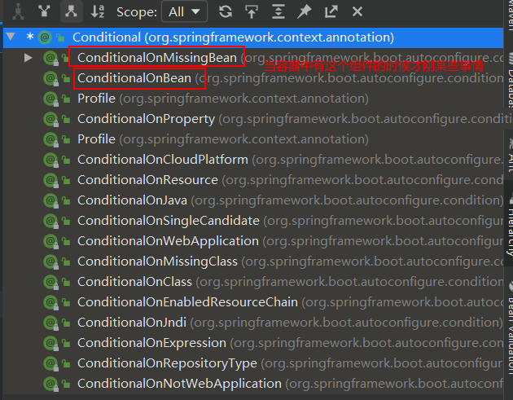

# 一，Spring Boot 基础

## 1，了解自动配置原理

### 1.1 Spring Boot特点

#### 1.1.1 依赖管理

- 父项目做依赖管理

```xml
依赖管理
 <parent>
     <artifactId>spring-boot-starter-webflux</artifactId>
     <groupId>org.springframework.boot</groupId>
     <version>2.3.4</version>
 </parent>
他的父项目
<parent>
    <groupId>org.springframework.boot</groupId>
    <artifactId>spring-boot-dependencies</artifactId>
    <version>2.3.4.RELEASE</version>
</parent>

几乎声明了所有开发中常用的依赖的版本号,自动版本仲裁机制
<properties>
	<mysql.version>5.1.49</mysql.version>
</properties>
```

- 开发导入场景启动器

```markdown
1、见到很多 spring-boot-starter-* ： *就某种场景
2、只要引入starter，这个场景的所有常规需要的依赖我们都自动引入
3、SpringBoot所有支持的场景
https://docs.spring.io/spring-boot/docs/current/reference/html/using-spring-boot.html#using-boot-starter
4、见到的 *-spring-boot-starter： 第三方为我们提供的简化开发的场景启动器。
5、所有场景启动器最底层的依赖
<dependency>
    <groupId>org.springframework.boot</groupId>
    <artifactId>spring-boot-starter</artifactId>
    <version>2.3.4.RELEASE</version>
    <scope>compile</scope>
</dependency>
```

- 无需引入依赖版本，Spring Boot会自动版本仲裁
- 可以修改默认的版本

```xml
<parent>
    <groupId>org.springframework.boot</groupId>
    <artifactId>spring-boot-starter-parent</artifactId>
    <version>2.2.6.RELEASE</version>
</parent>
<!--覆盖默认版本-->
<properties>
	<mysql.version>5.1.49</mysql.version>
</properties>

<dependencies>
<dependency>
    <groupId>org.springframework.boot</groupId>
    <artifactId>spring-boot-starter-web</artifactId>
</dependency>
<dependency>
    <groupId>mysql</groupId>
    <artifactId>mysql-connector-java</artifactId>
</dependency>
</dependencies>
```

#### 1.1.2 自动配置

- 自动配置好tomcar

- 自动配置好Spring MVC

    - 自动配置好Spring MVC 的常用组件

- 自动配置web开发常见功能，如：字符编码问题

- 默认包结构

    - 主程序所在包及其下面的所有子包里面的组件都会被默认扫描进来

    - 无需以前的包扫描配置

    - 想要更改包扫描路径可以假如一下配置

        ```markdown
        # @SpringBootApplication(scanBasePackages="指定包名")
        或
        # @ComponentScan 指定扫描路径
         @SpringBootApplication
         等同于
         @SpringBootConfiguration
         @EnableAutoConfiguration
         @ComponentScan("com.atguigu.boot")
        ```

- 各种默认配置拥有默认值

- 按需加载所有自动配置项目

    - 只有引入starter某些配置才会开启
    - 所有的自动配置功能都在spring-boot.autoconfigure包中

## 2，容器功能

### 2.1 组件添加

#### 1，@Configuration

- 基本使用
- Full模式与Lite模式

##### ① 新建Spring Boot程序，创建主程序、宠物类、用户类

```java
//@SpringBootApplication(scanBasePackages ="com.example.test" )
@SpringBootConfiguration
@EnableAutoConfiguration
@ComponentScan("com.example")
public class SpringbootTestApplication {

    public static void main(String[] args) {
        //1，直接返回IOC 容器
        ApplicationContext context = SpringApplication.run(SpringbootTestApplication.class, args);

        //2，查看容器中的所有组件
        String[] names = context.getBeanDefinitionNames();
        for (String name : names) {
            System.out.println(name);
        }
    }
}
//User、Pet
@Data
@AllArgsConstructor
public class Person {
    private String name;
    private Integer age;
}
@Data
@AllArgsConstructor
public class Pet {
    private String name;
}
```

##### ② 加载组件

- 对比以前原生spring添加组件的区别
    如果是以前的原生spring，想要将组件添加到容器中
    1.需要在resources目录下创建一个[xml](https://so.csdn.net/so/search?q=xml&spm=1001.2101.3001.7020)配置文件
    2.创建bean标签

```xml
<bean id="person" class="org.example.bean.Person">
    <property name="age" value="18"/>
    <property name="name" value="lishizhan"/>
</bean>
```

- 现在的Spring Boot已经不需要向以前一样了，有一个注解@Configuration（翻译：配置）可以供使用
    1.创建一个类。
    2.使用注解@Configuration，告诉Spring Boot这是一个配置类。

```java
//告诉Spring Boot 这是一个配置类
@Configuration(proxyBeanMethods = true)
public class FullAndLifeConfiguration {
	//...
}
```

- 这个时候在类里边不能写bean标签了需要使用@bean注解，想要构建出user和pet对象需要自己将它创造出来。
    @bean：给容器中添加组件，以方法名作为组件的id。返回类型为组件类型，返回的值，就是组件在容器中的实例

```java
@Configuration(proxyBeanMethods = true)
public class FullAndLifeConfiguration {\
    //给容器中添加组件。以方法名作为组件的id。返回类型就是组件类型。返回的值，就是组件在容器中的实例
    @Bean
    public Person person01(){return new Person("zhans",22);}
    @Bean
    public Pet pet01(){return new Pet("pig");}
}
```

##### ③ 验证组件是否成功

- 直接在主程序中打印容器中所有组件的名字，其中配置类中的组件名字是方法名或者是@Bean("组件名")

```java
//2，查看容器中的所有组件
String[] names = context.getBeanDefinitionNames();
for (String name : names) {
    System.out.println(name);
}
//打印结果包含注册的组件：person、pet
```

##### ④ 判断容器中组件是否为单实例的

```java
 //重复获取容器中的对象
 Person person01 = context.getBean("person01", Person.class);
 Person person02 = context.getBean("person01", Person.class);
 System.out.println("重复获取容器中的对象是否相等？===>" + (person01 == person02));
 //运行结果为true
```

- 可以看到，返回的都是true，也就说明都是相等的 。
    所以：配置类里面使用@Bean标注在方法上给容器注册组件，默认是单实例的。
    同时还有一点，被@Configuration标注的类本身也是一个组件
    可以从容器中取这个类来验证一下。

```java
//配置本身也是一个组件也是在容器中的
FullAndLifeConfiguration bean = context.getBean(FullAndLifeConfiguration.class);
Person person03 = bean.person01();
Person person04 = bean.person01();
System.out.println("重复获取配置类组件中的对象是否相等？===>" + (person03 == person04));
```

##### ⑤ Full与Lite模式的proxyBeanMethods

同时，在Spring Boot 5.2之后的@Configuration注解多了一个属性proxyBeanMethods，默认为true（翻译：代理bean的方法）

```java
@Configuration(proxyBeanMethods = true)
public class FullAndLifeConfiguration {}
```

- 顾名思义，既然默认为true了，也就是默认代理。
    代理就会保持组件的单实例。
    也就是说，虽然写的FullAndLifeConfiguration是在容器中注册组件用的，但是在注册组件之前会在容器中查找有没有该组件。如果有，则取该组件用于保证单实例，如果没有再注册一个新的组件。
    可以调用两次注册组件的方法来确认是否使用了代理

- 如果将@Configuration(proxyBeanMethods = true)改为false

    再次运行就会发现这次取的不是代理对象，也就是每一个方法都新注册了一个组件，所以两个不相等。
    因为改为false后久不会再保存代理对象了。

```java
//配置本身也是一个组件也是在容器中的
FullAndLifeConfiguration bean = context.getBean(FullAndLifeConfiguration.class);
Person person03 = bean.person01();
Person person04 = bean.person01();
System.out.println("重复获取配置类组件中的对象是否相等？===>" + (person03 == person04));
/*
	配置类proxyBeanMethods为true时：获取组件实例是单例
	配置类proxyBeanMethods为false时：获取组件实例是非单例
*/
```

##### ⑥ 总结

```
proxyBeanMethods：代理bean的方法
有两种模式：
1.Full:(proxyBeanMethods = true) //全模式
使用代理模式，保证组件的单实例，启动不如false快，但是重复利用率高，适用于会重复使用组件的场景。
2.lite:(proxyBeanMethods = false) //轻量级
不是用代理模式，不用保证组件的单实例，启动最快。单每次调用组件都会重新创建一个新的组件，组件可重复使用率低。适用于需要组件但不会重复使用的场景
总结：用于解决组件依赖
```

#### 2，@Import 导入组件

- 在平时看源码或者很多配置类上面都会出现@Import注解,功能就是和Spring XML 里面 的 一样. @Import注解是用来导入配置类或者一些需要前置加载的类.

```java
//给容器中自动创建出这两个类型的组件、默认组件的名字就是全类名
@Import({Animal.class,User.class})
//告诉Spring Boot 这是一个配置类
@Configuration(proxyBeanMethods = true)
public class MyConfig {}
```

#### 3，条件装配@Conditional

- @Conditonal是Spring中常用的一个注解，标记了该注解后，只有在满足@Conditonal中指定的所有条件后，才可以向容器中注入组件。



```javascript
@Configuration
public class UserConfig {

    @Bean
    @ConditionalOnMissingBean(name = "tom") //当组件中有tom才会注册user, 加在类上则所有的组件都会被注入
    public User user(){
        return new User("zhans",23);
    }

    @Bean("tom")
    public Pet pet(){
        return new Pet("Tom",1);
    }
}
```

```java
//条件装配 @Conditional
boolean user = context.containsBean("user");
System.out.println("容器中user组件：" + user);
boolean tom = context.containsBean("tom");
System.out.println("容器中tom组件：" + tom);
```


#### 4，@ImportResource Spring中XML导入

- 主要用于导入Spring的xml配置文件注册的Bean

```java
@SpringBootApplication
@ImportResource("classpath:beans/beans.xml")
public class SpringbootTestApplication {
    public static void main(String[] args) {
        ApplicationContext context = SpringApplication.run(SpringbootTestApplication.class, args);
        User user01 = (User) context.getBean("user01");
        User user02 = (User) context.getBean("user02");
        System.out.println("user01 = " + user01);
        System.out.println("user02 = " + user02);

    }
}
```

beans.xml

```xml
<?xml version="1.0" encoding="UTF-8"?>
<beans xmlns="http://www.springframework.org/schema/beans"
       xmlns:xsi="http://www.w3.org/2001/XMLSchema-instance"
       xsi:schemaLocation="http://www.springframework.org/schema/beans http://www.springframework.org/schema/beans/spring-beans.xsd">

    <bean id="user01" class="com.example.annotations.beans.User">
        <property name="name" value="lisi"/>
        <property name="age" value="24"/>
    </bean>
    <bean id="tom01" class="com.example.annotations.beans.Pet">
        <property name="name" value="tom01"/>
        <property name="age" value="3"/>
    </bean>
</beans>
```


#### 5，配置绑定@ConfigrationProperties + @Component 或者@EnableConfigrationProperties

- 如何使用Java读取properties文件中的内容，并且把它挂载到Java中bean中，以供使用
- 实现配置文件中的属性默认绑定到类中

##### ① 原生方式

```java
/**
* 原生方式：
* 获取properties文件中的数据
*/
public static void getProperties() throws IOException {
    Properties properties = new Properties();
    properties.load(new FileInputStream("springboot-test\\src\\main\\resources\\test.properties"));
    //获取配置文件名字 
    Enumeration<?> names = properties.propertyNames();
    while (names.hasMoreElements()) {
        String key = (String) names.nextElement();
        String value = properties.getProperty(key);
        System.out.println(key + " = " + value);
    }
}
```

##### ②使用@ConfigrationProperties + @Component配置属性

```properties
# 自定义配置参数
myinfo.name=lishizhan
myinfo.age=25
```

- 添加@ConfgrationProperties(prefix="配置文件中属性前缀")
- 注意：要加@Component注册进容器中才有效果

```java
@Data
@AllArgsConstructor
@NoArgsConstructor
@Component
@ConfigurationProperties(prefix = "myinfo")
public class Person {
    private String name;
    private Integer age;
}
```

- 测试

```java
@Autowired
private Person person;

@GetMapping("info")
public Person userInfo(){
	return person;
}
```

- 结果

```json
// 20220707005843
// http://localhost:8080/info

{
  "name": "lishizhan",
  "age": 25
}
```

③ @EnbleConfigrationProperties

- 直接在配置类中加入该注解，一、开启某个类的属性配置；二、把指定的类注册到容器中，这样就不需加@Component

```java
@Configuration
@EnableConfigurationProperties(Person.class)
public class UserConfig {}
```

```java
@Data
@AllArgsConstructor
@NoArgsConstructor
//@Component
@ConfigurationProperties(prefix = "myinfo")
public class Person {
    private String name;
    private Integer age;
}
```

## 3，Spring Boot自动配置原理


# 二，核心功能

## 1，配置文件

- properties 配置文件

  ```properties
  # 应用名称
  spring.application.name=springboot-annotations
  # 应用服务 WEB 访问端口
  server.port=8080
  ```

- yum 配置文件非常适合以数据为中心的配置文件

  ```markdown
  基本语法：
  	大小写敏感
  	用缩进表示层级关系
  	缩进只允许空格，不允许tab
  	字符串无需加引号，特殊字符需要转意的时候加
  		单引号：会将\n作为字符串输出、双引号作为换行符输出
  		双引号：不会转义
  ```

  ```yml
  # 数据类型：
  	#字面量。date、boolean string number null
      	K: V
      #对象，键值对集合，一组按次序排列的值。map、hash、set、object
      	#行内写法
      	k: {k1:v1,k2:v2,k3:v3}
      	#或者
      	k: 
      	  k1: v1
      	  k2: v2
      	  k3: v3
     #数字
     		#行内写法
     		k: [v1,v2,v3]
     		#或
     		k: 
     		 - v1
     		 - v2
     		 - v3
  ```

  - 案例

    ```java
    @Component
    @ConfigurationProperties(prefix = "person") //配置文件中以什么为前缀
    @Data
    public class Person {
        private String username;
        private Boolean boss;
        private Date birth;
        private Integer age;
        private Pet pet;
        private String[] interests;
        private List<String> animal;
        private Map<String, Object> score;
        private Set<Double> salary;
        private Map<String, List<Pet>> allPets;
    }
    ```

    ```yml
    person:
      username: zhans
      boss: true
      birth: 1998/08/08
      age: 23
    #  interests: [游泳,游戏,篮球]
      interests:
        - 游泳
        - 游戏
        - 篮球
      animal: [旺财,来福]
    #  score: {english:80,math: 90,yuwen: 100}
      score:
        english: 80
        math: 90
        yuwen: 100
      salary:
        - 9999.99
        - 8888.88
      pet:
        name: 旺财
        weight: 32.32
      allPets:
        white:
          - {name: 旺财,weight: 33.33}
        black:
          - {name: 来福,weight: 44.44}
    ```

    - 自定义配置提示

    - ```xml
      <dependency>
          <groupId>org.springframework.boot</groupId>
          <artifactId>spring-boot-configuration-processor</artifactId>
          <optional>true</optional>
      </dependency>
      <plugin>
          <groupId>org.springframework.boot</groupId>
          <artifactId>spring-boot-maven-plugin</artifactId>
          <configuration>
              <excludes>
                  <!--在哒成jar包时候排除配置文件提示-->
                  <exclude>
                      <groupId>org.springframework.boot</groupId>
                      <artifaguration>spring-boot-configuration-processor</artifaguration>
                  </exclude>
              </excludes>
          </configuration>
      </plugin>
      ```


## 2，web开发

### 2.1 静态资源目录

```markdown
By default, Spring Boot serves static content from a directory called /static (or /public or
/resources or /META-INF/resources) in the classpath or from the root of the ServletContext.
```

- 类路径下：/static (or /public or /resources or /META-INF/resources)


```
# 访问路劲：http://localhost:8080/Snipaste_2022-07-08_14-20-48.png
```

- 原理：静态映射/**

  请求进来先去controller看看能不能处理，不能处理的所有请求都交给静态资源处理器，静态资源处理器处理不了则404

- 改变静态资源访问路径

  ```yml
  #配置静态资源访问前缀，这样在配置拦截器的时候就可以指定放行 配置这个会导致favicon.ico失效
  spring:
    mvc:
      static-path-pattern: /res/**
  # http://localhost:8080/res/bug.png
  ```

- 指定静态资源路径

  ```yml
  # 改变静态资源路径
    resources:
      static-locations: [classpath: /mystatic/]
  ```

- webjars：静态资源打包为jar包：https://www.webjars.org/

  ```xml
  <dependency>
      <groupId>org.webjars.npm</groupId>
      <artifactId>jQuery</artifactId>
      <version>1.7.4</version>
  </dependency>
  ```

  

### 2.2 欢迎页支持


## 3，数据访问

## 4，指标监控

## 5，原理解析


# 三，场景整合